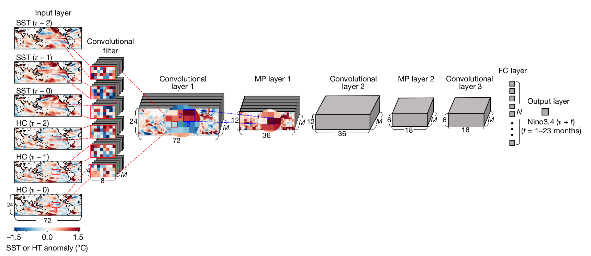
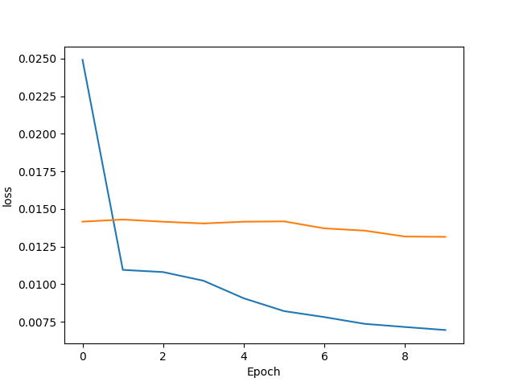
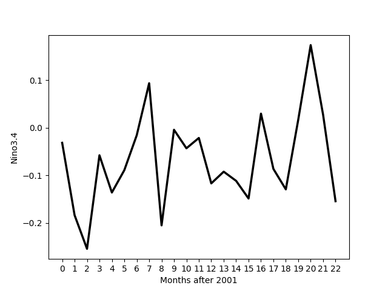

# ENSO prediction with Deep Learning
This repo implements a convolution neural net to predict the Nino3.4 index 23 months in advance. The data for this is found at https://drive.google.com/file/d/1Ht6__G4bFWguZTJ3nKc3XuEY1KKLMIIN/view?usp=sharing.

## Structure and Design

The explaination of the files are as follows

| File           | Description                                   |
| ---------      | --------------------------------------------- |
| main.py        | The model is trained and saved here           |
| src            | model architecture is implemented here        |
| data_builder   | creates .npy data                             |
| plot_pred      | plots prediction graph                        |
| param.json      | json file that stores hyper parameters                      |

## Dependencies

### External
- tensorflow
- matplotlib
- numpy


### Native
- json
- argparse

## Neural Network Architecture



## Running

You can run the training of the model by

```bash
python main.py --load_model 'False'    
```

You can load the model by

```bash
python main.py --load_model 'True'
```


## Hyperparameters


|Parameter        | Description                                      |
| ---------       | ---------------------------------------------    |
| learning rate   | learning rate                                    |
| num_epochs      | number of epochs for training                    |
| batch_size      | batch size for training purposes                 |
|   n_f           | number of convolutional filters                  |
|n_d              | number of dense layers at the end                |
## Results

### The loss graph



### The predictions



## Acknowledgements

Ham, Y. G., Kim, J. H. & Luo, J.-J. Deep learning for multi-year ENSO forecasts. Nature 573, https://doi.org/10.1029/2010JC006695 (2019).